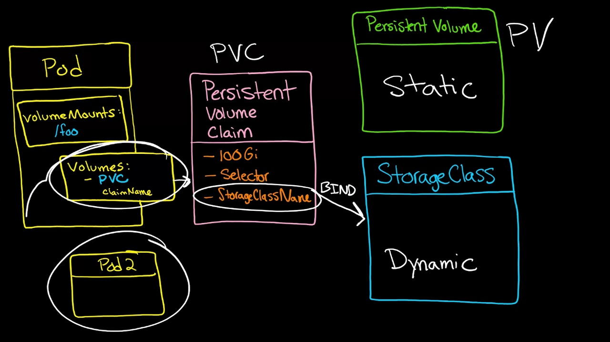

# Storage

## Dynamic Provisioning

In order to allow dynamic provisioning, you must first have a [StorageClass](storageclass.md).

Users request dynamically provisioned storage by including a storage class in their [PersistentVolumeClaim](persistentvolumeclaims.md).

